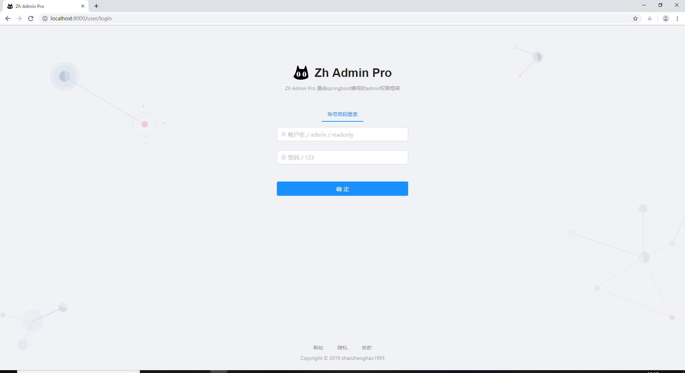
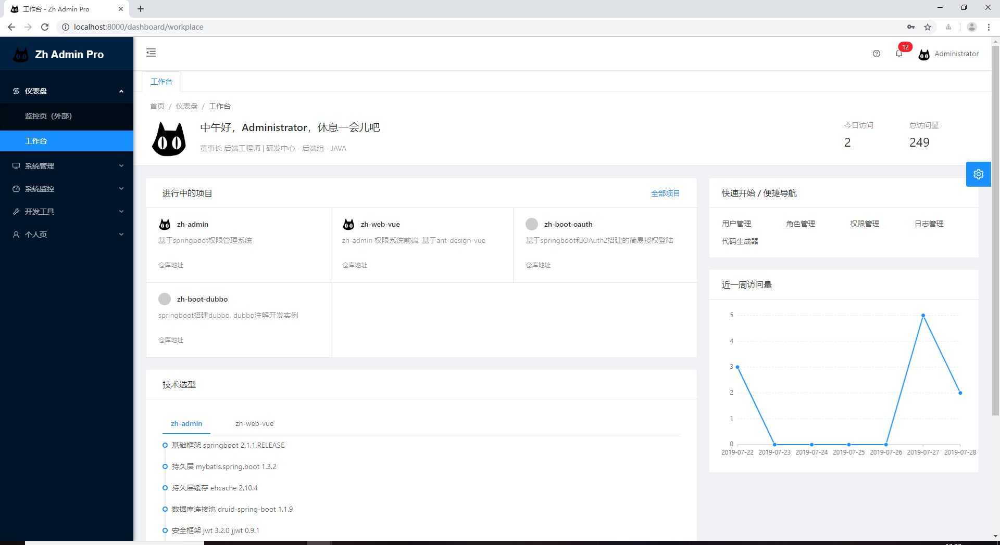
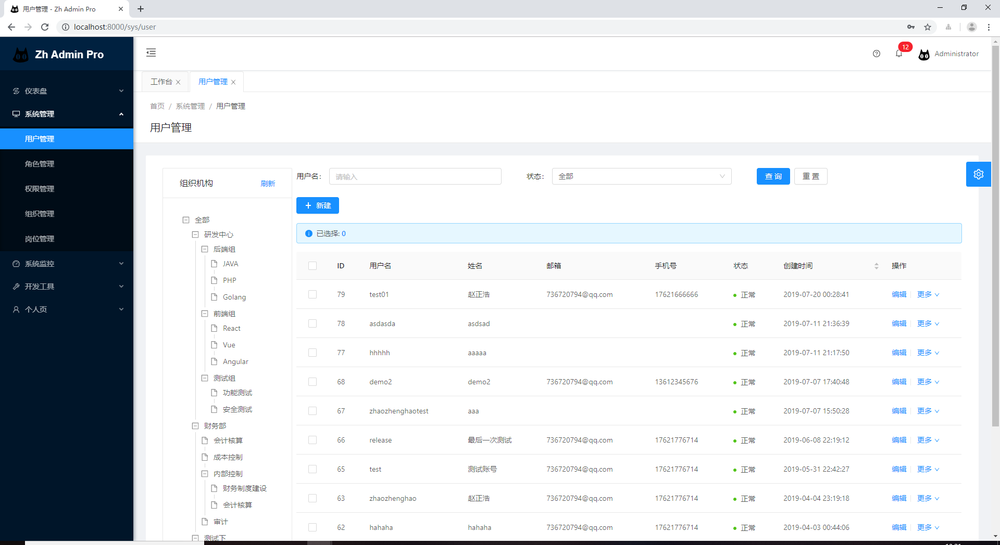
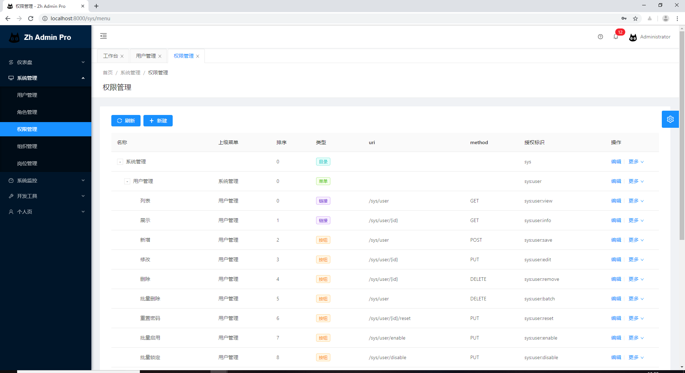
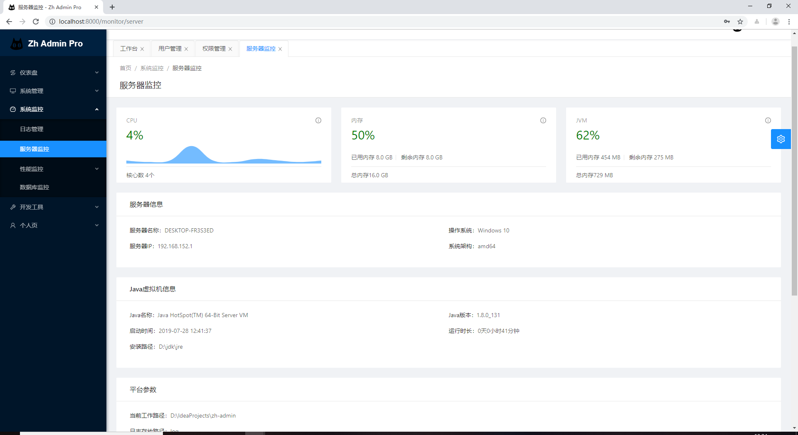
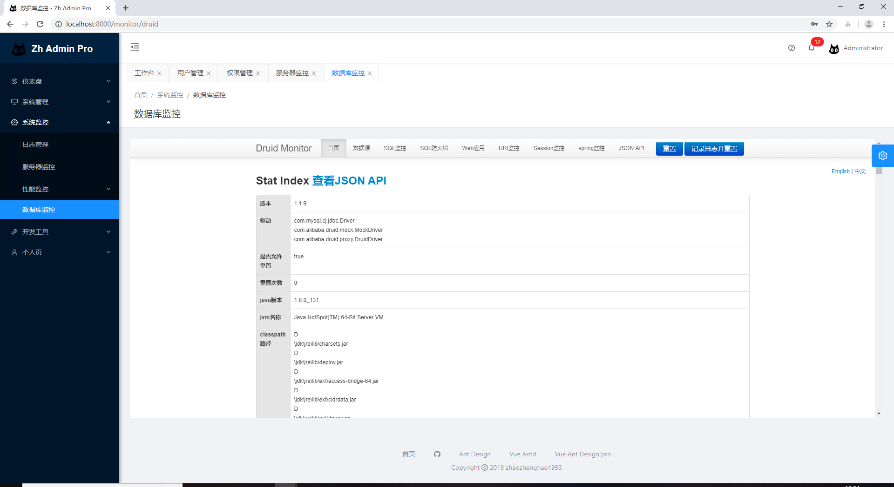
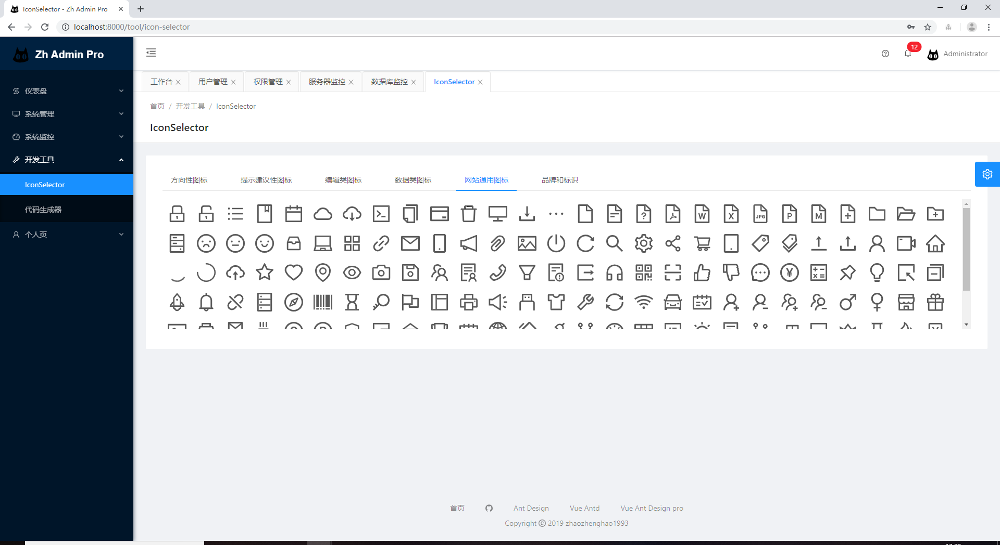
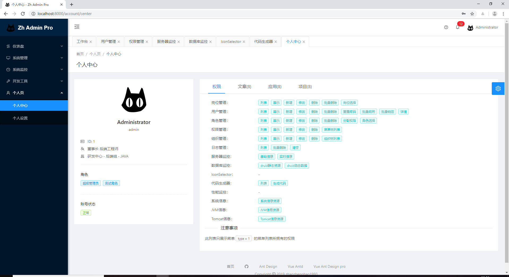
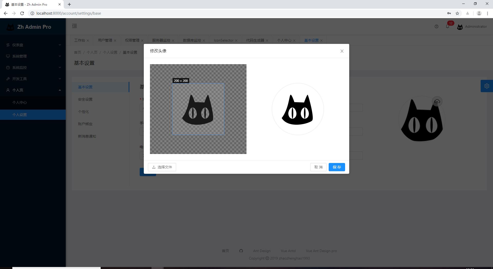

<p align="center">
  <a href="#">
    
  </a>
</p>

<h1 align="center">zh-admin</h1>

<div align="center">

一个简单的 springboot 权限管理 api 脚手架.

[](https://github.com/zhaozhenghao1993/zh-admin/releases)
[](https://www.travis-ci.org/zhaozhenghao1993/zh-admin)
[](https://codecov.io/gh/zhaozhenghao1993/zh-admin)

</div>

## 项目介绍

zh-admin 是一个简单的 springboot 权限管理 api 框架。采用前后端分离，代码简单，方便二次开发，包含鉴权管理、服务器监控、代码生成器、个人自定义主题等模块，拿来即用，降低繁杂的开发成本。

后端模块选用 jwt、过滤器、拦截器，实现对 restful 风格 api 鉴权。权限控制精确到每个请求的 uri 和 method ，支持通配符批量放行。

## 适用项目

如果你想找一个需要鉴权的框架，zh-admin 可以满足，不用关注权限，只需编写业务代码，之后注册权限即可，适合中小型项目。

## 前端地址

[zh-web-vue](https://github.com/zhaozhenghao1993/zh-web-vue)

## 演示环境

[http://106.12.21.222](http://106.12.21.222)

## 技术选型

#### 后端

- 基础框架 springboot 2.1.1.RELEASE
- 持久层 mybatis.spring.boot 1.3.2
- 持久层缓存 ehcache 2.10.4
- 数据库连接池 druid-spring-boot 1.1.9
- 安全框架 jwt 3.2.0 jjwt 0.9.1
- 分页 pagehelper 1.2.5
- 摸板引擎 velocity 1.7

#### 前端

- vue
- vuex
- axios
- @vue/cli ~3
- ant-design-vue
- ant-design-vue-pro - 脚手架
- vue-cropper - 头像裁剪组件
- @antv/g2 - Alipay AntV 数据可视化图表
- Viser-vue - antv/g2 封装实现

#### 环境

- jdk1.8
- maven
- mysql

## 项目模块

```
├─仪表盘
│  └─工作台
├─系统管理
│  ├─用户管理
│  ├─角色管理
│  ├─权限管理
│  ├─部门管理
│  └─岗位管理
├─系统监控
│  ├─日志管理
│  ├─服务器监控
│  ├─性能监控
│  │  ├─服务器信息
│  │  ├─jvm信息
│  │  └─Tomcat信息
│  └─数据库监控
│─开发工具
│  ├─IconSelector
│  └─代码生成器
│─个人页
└─ ├─个人中心
   └─个人设置
      ├─基本设置
      ├─安全设置
      └─个性化设置
```

```
zh-admin
├─zh-auth (系统用户权限管理、用户个人中心设置、鉴权过滤器等模块)
├─zh-common (公共基础模块，需要其他模块引用，包含公共util、日志注解、公共aop、基础类)
├─zh-generator (代码生成器模块)
├─zh-main (springboot启动模块，包含启动配置文件、启动类、Dockerfile、单元测试)
├─zh-monitor (系统服务器监控模块，包括日志模块、服务器监控、性能监控)
└─待开发
```

## 快速开始

#### 导入数据库初始化SQL脚本

```
位于 zh-admin/sql 目录下
zh-admin.sql (初始化脚本)
test-admin.sql (为我的开发脚本，请忽略)
```

#### 修改配置文件

```
位于 zh-admin/zh-main/src/main/resources 目录下 application-dev.yaml
修改 mysql数据库url
```

#### 编译源码

按照maven格式将源码导入IDE, 使用maven进行编译即可。

#### 前端项目编译

请查看 [zh-web-vue](https://github.com/zhaozhenghao1993/zh-web-vue)

## docker镜像

```
docker pull zhaozhenghao1993/zh-admin

docker run -e PARAMS="--spring.datasource.druid.url=jdbc:mysql://192.168.0.104:3306/test-admin?useUnicode=true&characterEncoding=UTF-8&allowMultiQueries=true&serverTimezone=GMT%2B8 --spring.datasource.druid.username=root --spring.datasource.druid.password=root --zh-admin.file.log.folder=/data/app/zh-admin/log" -p 8081:8081 -v /tmp:/data/app --name zh-admin -d zhaozhenghao1993/zh-admin:1.0.0
```

## 系统展示

















